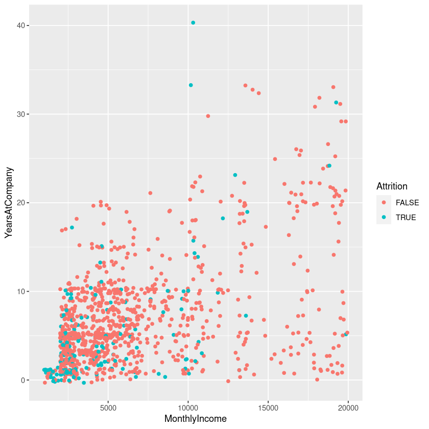
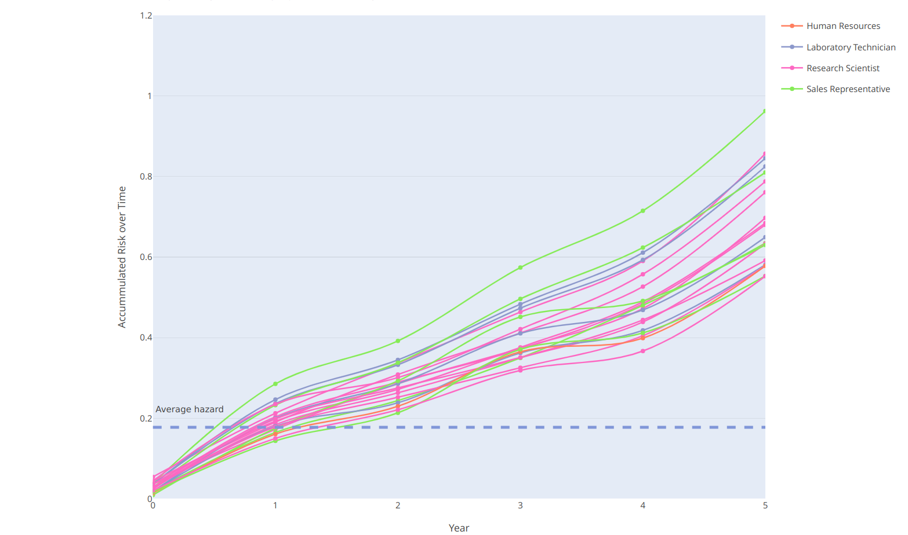
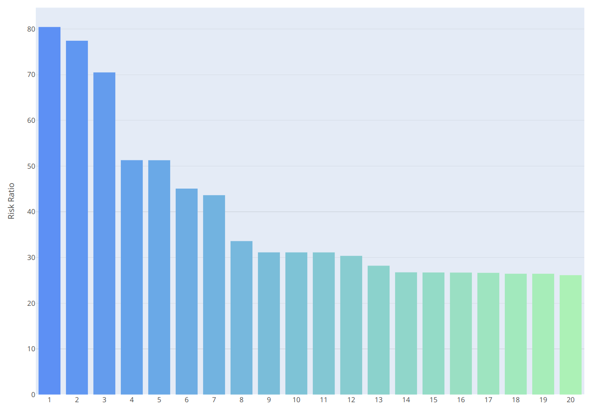

## Executive Summary

This analysis uses survival analysis and machine learning techniques to identify key drivers of employee attrition in IBM. We found that monthly salary, job level, overtime work, job role and stock options level were consistently predictive of retention risk. Based on these results, management should consider stay interviews, compensation adjustments, work time reduction and strategic engagement initiatives to retain valuable at-risk talent, especially among individual contributors earning less than \$50K annually. Regular re-evaluation of attrition risks can help optimise workforce planning and reduce turnover costs in the future.

## Background & Objectives

Employee attrition impacts productivity and operational costs. As IBM expands its market, understanding retention challenges is critical for strategic decision-making. The goal of this study was to assess which employee attributes influence the likelihood and timing of voluntary departures. Identification of at-risk groups will guide effective interventions by leadership.

## Data Cleaning & Exploration

Our analysis considered data from 1,470 IBM employees. No missing values were present. Exploratory analysis revealed an interesting pattern - employees in the lowest monthly income range (\$1-2k) exhibited anomalously narrow variation of years working at our company, potentially reflecting intern retention patterns. These observations were removed to avoid skewing results.

```{r, echo=FALSE, fig.cap="Figure 1. Comparison between monthly income and active years at IBM", out.width="50%", fig.align="center"}

```

## Predictive Modeling & Results

Cox regression identified monthly income, job role, overtime and stock option level as strong predictors of attrition. Random forest modeling confirmed their relative importance, along with several additional factors such as training frequency, environmental satisfaction, number of previous companies, unemployment length and work-life balance. Cumulative hazard plots showed risk steadily increasing over 5 years at an average rate of 12\%-16\%, while hazard ratio from Cox regression indicates seven employees at significantly higher risk.

```{r, echo=FALSE, fig.cap="Figure 2a. Top at-risk employees based on Random Forest model (categorised by job position)", fig.align="center", out.width="90%"}

```
```{r, echo=FALSE, fig.cap="Figure 2b. Top at-risk employees based on Cox regression model", fig.align="center"}

```

## Recommendations & Next Steps

We recommend the following actions based on our findings:

-   Conduct regular stay interviews with employees predicted by our model as at high risk of turnover. Gathering feedback can provide insights on improving retention.

-   Enhance career welfare support programs through initiatives that promote work-life balance, such as overtime guidelines and flexible working arrangements.

-   Design a targeted retention program for sales representatives given their high impact role. Explore ways to boost engagement through acknowledgement programs, team building activities, and leadership support. Inter-team dynamics should also be considered.

-   Review compensation policies for lower level roles and those with zero-level stock options. Strategic adjustments could aid retention of at-risk talent identified in our analysis.

Continued evaluation and modelling with new data can optimize these efforts over time.

## Conclusion

In summary, this attrition risk assessment uncovered actionable insights into how workforce characteristics relate to retention challenges. Strategic use of these results has potential to improve productivity and reduce costs for IBM. I thank you for your consideration of my recommendations.

## Appendix

A [Jupyter notebook](https://nbviewer.org/github/ShuuheiAlb/shuuheialb.github.io/blob/main/projects/employee-attrition/risk-assessment.ipynb) is also attached for supplementation, allowing for interactive exploration of the data and model results.

